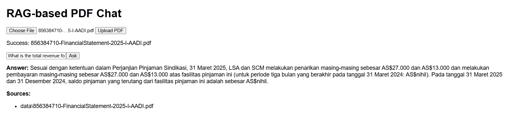

# RAG-based Document Q&A System

This project is a **full-stack Retrieval-Augmented Generation (RAG)** system for answering questions from uploaded PDF documents. It uses:

- **Next.js (React)** for the frontend
- **FastAPI** for the backend API
- **LangChain + ChromaDB** for RAG pipeline
- **google/flan-t5-base** as the LLM
- **all-MiniLM-L6-v2** for embeddings

---

## 📁 Project Structure

```
full-stack-QA-application/
├── backend/
│   ├── main.py              # FastAPI app with PDF upload and chat API
│   ├── config.py            # Model and DB config
│   ├── requirements.txt     # Python dependencies
│   ├── models/
│   │   └── schemas.py       # Pydantic schema
│   ├── services/
│   │   ├── pdf_processor.py # PDF file handling
│   │   ├── rag_pipeline.py  # LLM + Retriever QA logic
│   │   └── vector_store.py  # Embedding & vector DB logic
├── frontend/
│   ├── pages/               # Next.js pages
│   ├── components/          # FileUpload & ChatInterface
│   ├── styles/              # Basic styling
│   ├── package.json         # NPM config
│   └── tsconfig.json        # TypeScript config
└── data/                    # Uploaded PDFs
```

---

## 🚀 1. Backend Setup (FastAPI + LangChain + HuggingFace)

### 🔧 Prerequisites

- Python 3.10+
- pip or conda
- Optional: virtualenv

---

## 🔐 Environment Variables

Before running the backend, create a `.env` file inside the `backend/` folder with the following content:

```env
GOOGLE_API_KEY=add_your_key_here
VECTOR_DB_PATH=./vector_store
PDF_UPLOAD_PATH=../data

---

### 📦 Install

```bash
cd backend
python -m venv venv
source venv/bin/activate  # Windows: venv\Scripts\activate
pip install -r requirements.txt
```

### ▶️ Run the backend

```bash
uvicorn main:app --host 0.0.0.0 --port 8000 --reload
```

API Docs: http://localhost:8000/docs

---

## 💻 2. Frontend Setup (Next.js + React)

### 🔧 Prerequisites

- Node.js 16+
- npm or yarn

### 📦 Install

```bash
cd frontend
npm install
```

### ▶️ Run the frontend

```bash
npm run dev
```

Visit: http://localhost:3000

---

## 🧠 3. RAG Model Pipeline

### ✨ Embedding Model
- `sentence-transformers/all-MiniLM-L6-v2`
- Loaded using LangChain HuggingFaceEmbeddings

### 🧠 LLM Model
- `google/flan-t5-base` via Transformers pipeline
- Used with LangChain's `HuggingFacePipeline`

### 📚 Vector DB
- `ChromaDB`
- Stores PDF chunks and enables semantic search

---

## ⚙️ 4. Backend Endpoints

| Method | Endpoint        | Description                         |
|--------|------------------|-------------------------------------|
| POST   | /api/upload      | Upload and chunk a PDF              |
| GET    | /api/documents   | List all uploaded documents         |
| POST   | /api/chat        | Ask a question, get RAG answer      |

---

## 🧪 Example Workflow

1. Start backend and frontend
2. Go to http://localhost:3000
3. Upload a PDF file
4. Ask a question (e.g., “What is the total revenue in 2025?”)
5. Get an answer with referenced source chunks

---

## 📌 Notes

- PDF files are stored in `backend/data/`
- Vector DB is saved in `backend/chroma_db/`
- Embedding and LLM models are loaded via HuggingFace
- For arithmetic answers (e.g., debt ratio), the backend can be extended with logic

---

## 🧾 Example Output Snapshot

Here’s an example when asking:

**Question:** What is the total revenue for 2025?

**Answer:**
```
Sesuai dengan ketentuan dalam Perjanjian Pinjaman Sindikasi, 31 Maret 2025, LSA dan SCM melakukan penarikan masing-masing sebesar AS$27.000 dan AS$13.000 dan melakukan pembayaran masing-masing sebesar AS$27.000 dan AS$13.000 atas fasilitas pinjaman ini (untuk periode tiga bulan yang berakhir pada tanggal 31 Maret 2024: AS$nihil). Pada tanggal 31 Maret 2025 dan 31 Desember 2024, saldo pinjaman yang terutang dari fasilitas pinjaman ini adalah sebesar AS$nihil.
```

**Sources:**
- data\856384710-FinancialStatement-2025-I-AADI.pdf


Below is a visual example of the PDF Q&A result in the browser:



